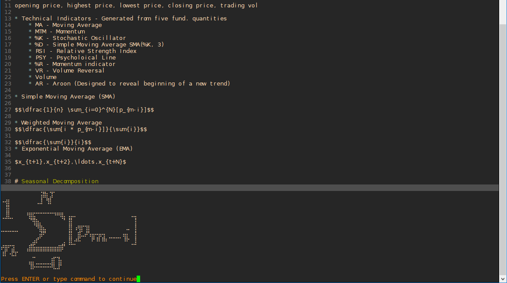

# vi_latex_preview

Scans the latex expression that your cursor is closest to on the current line and displays this as an output.

# Requirements
* vim python3
  * :call echo('python3')
* sympy
  * pip3 install sympy
* latex interpreter
  * sudo apt-get install texlive-full
* opencv
  * pip3 install opencv
* A font that support braille (Dejavu Sans - works best for me so far) Check for alternatives http://www.alanwood.net/unicode/fontsbyrange.html#u2800
   * Braille Patterns   U+2800 – U+28FF   (10240–10495)
   * Windows:  Braille, Code2000, DejaVu Sans, DejaVu Sans Condensed, DejaVu Serif, DejaVu Serif Condensed, Fixedsys Excelsior, Free Monospaced, Marin, Quivira, Sun-ExtA, UniBurma, YOzFontN
   * Macintosh OS X:  Apple Symbols
   * Unix:  ClearlyU
   * FUTURE:  inject the braile font into the standard terminal font because variable pitch is bad

# Installation
* Use your favorite Plugin manger (Vim-Plug) by adding to .vimrc
   * Plug 'ychnh/vi_latex_preview'

* and add bindings to .vimrc to use
    * nnoremap \<F2\> :call latex#Ltx()<CR>
